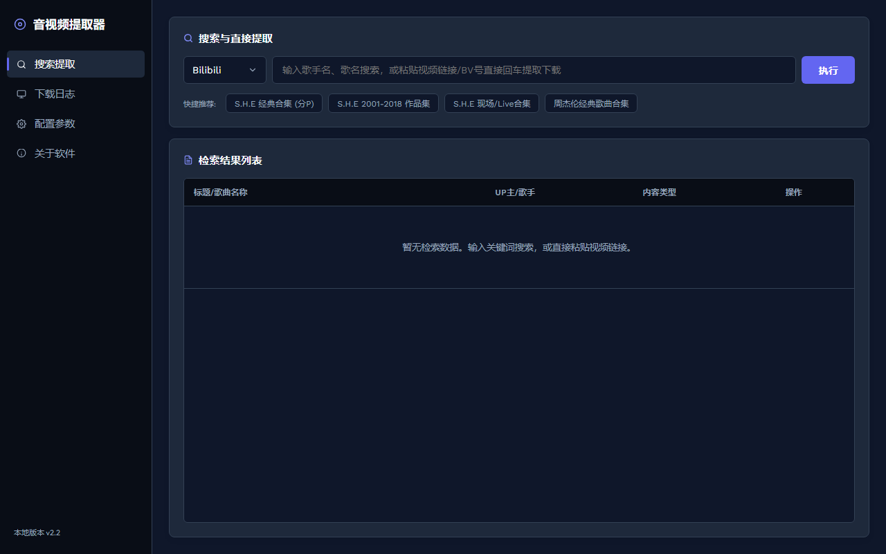
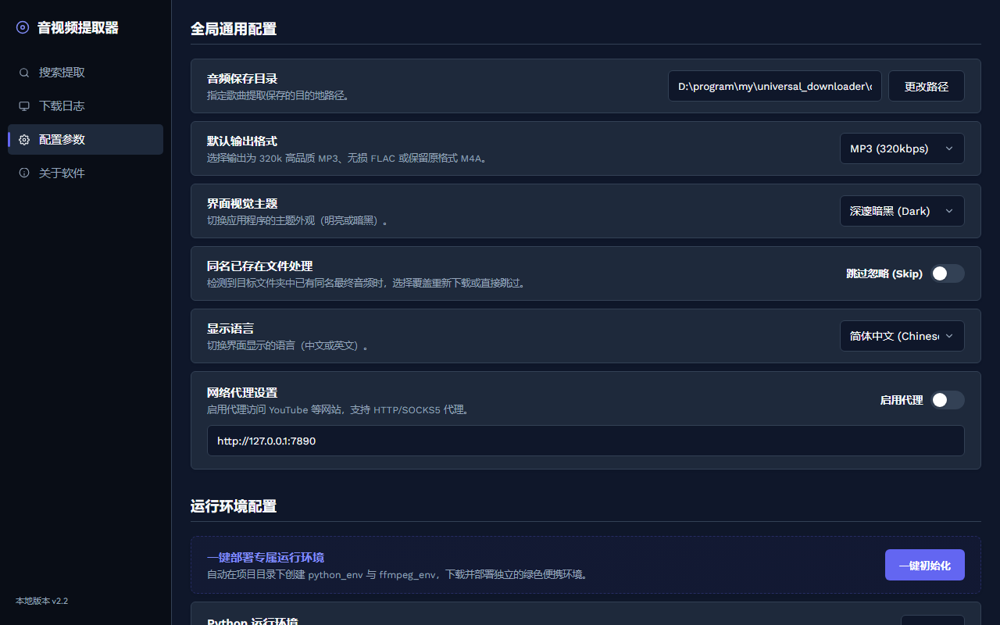
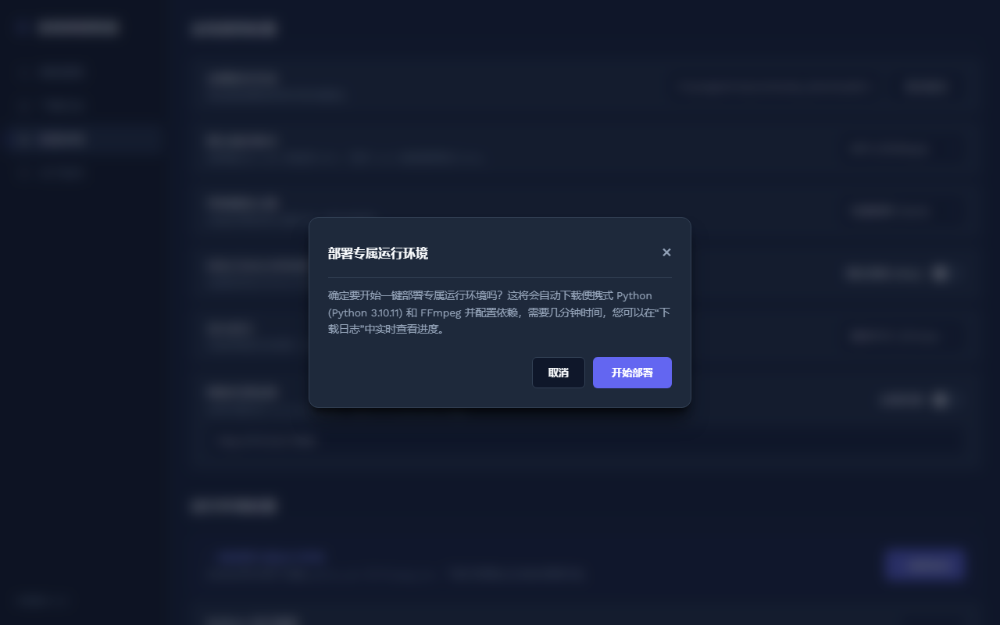
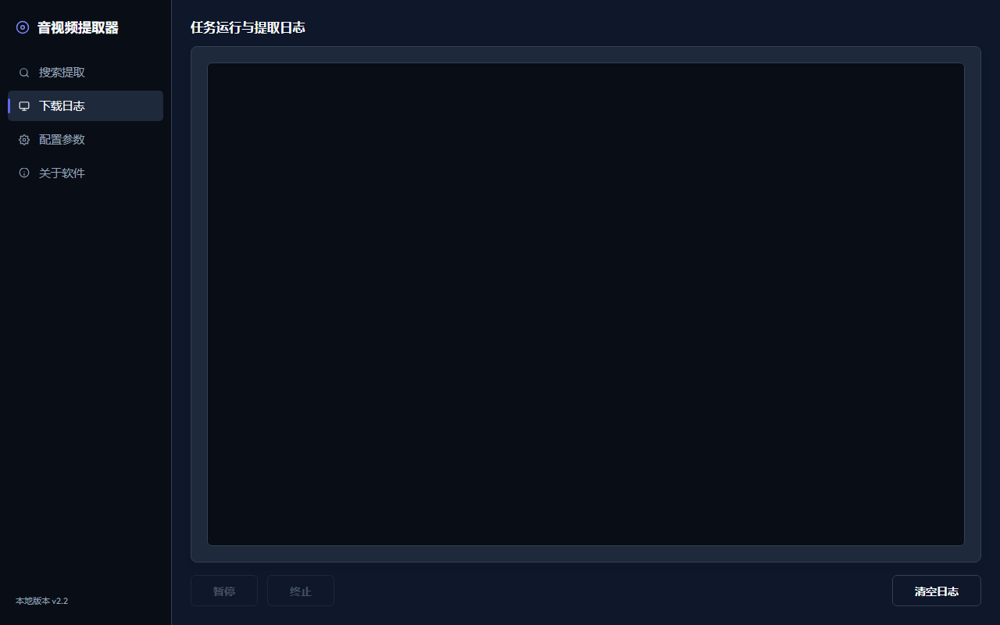

# 🎵 音视频全能提取下载器 (Universal Music/Video Downloader)

一个基于 **Python + Web 网页交互界面**、设计优雅、极速响应的音视频下载与提取工具。支持免安装的一键绿色运行环境部署，适合在 Windows 系统下快捷部署与使用。

---

## 🎨 界面预览

<table width="100%">
  <tr>
    <td width="50%" align="center">
      <b>1. 搜索与解析提取主页 (Search & Extract)</b><br/>
      
    </td>
    <td width="50%" align="center">
      <b>2. 几何极简配置面板 (Settings Panel)</b><br/>
      
    </td>
  </tr>
  <tr>
    <td width="50%" align="center">
      <b>3. 专属环境一键部署弹窗 (Modal Dialog)</b><br/>
      
    </td>
    <td width="50%" align="center">
      <b>4. 实时任务运行日志 (Realtime Logs)</b><br/>
      
    </td>
  </tr>
</table>

---

## ✨ 核心特性

- 📥 **双模式音视频提取**：
  - **搜索下载**：输入关键词，一键检索并列出最相关的搜索结果，提供封面、时长、清晰度与在线直连下载。
  - **链接解析**：直接复制粘贴 Bilibili 视频、网易云音乐单曲/歌单、YouTube 等链接即可智能分析并启动提取。
- 🎨 **极高颜值的微光毛玻璃 UI**：
  - 采用 **WinUI 3 几何极简设计风格**，自适应深色/浅色模式。
  - 拥有精美的磨砂玻璃（高斯模糊）遮罩弹窗、过渡微动画与呼吸光反馈，交互手感极其 premium。
- ⚙️ **一键绿色环境部署**：
  - 软件内置了 **一键初始化运行环境** 机制。首次使用时，只需在配置中点击一键初始化，即可全自动国内高速下载、部署并配置绿色免配置的便携式 Python (Python 3.10.11) 运行环境和免解压的 FFmpeg 转码核心。
  - **不污染系统全局 PATH 环境变量**，安全且绿色，拷贝即用，删除即走。
- 📊 **强大的任务进度与日志**：
  - 前端面板自带迷你状态进度条、下载速度、已下载体积的实时更新。
  - 拥有完整的历史运行日志页，并针对 Windows 控制台编码（GBK）做了防崩溃处理。
- 🛠️ **多任务及自定义配置**：
  - 支持设置保存路径、Bilibili 视频解析并发限制、以及重名文件是否默认覆盖。
  - 支持任务的**暂停 / 恢复 / 强行终止**等多重控制。

---

## 📁 项目目录结构

```text
universal_downloader/
│
├── main.py                  # 🚀 主程序启动入口
├── index.html                # 🎨 高颜值前端交互控制面板 (HTML / CSS / JS)
├── config.jsonc              # ⚙️ 软件个性化参数配置文件
├── 双击启动音乐下载器.bat     # ⚡ 一键智能引导启动脚本
│
├── core/                     # 📦 核心逻辑模块
│   ├── downloader_engine.py  # 🎵 下载核心处理器（智能分流与 yt-dlp 接口）
│   ├── web_server.py         # 🌐 原生 Python 实现的轻量级 API Web 服务
│   ├── env_init.py           # 📥 绿色便携式环境全自动部署器
│   └── logger.py             # 📝 线程安全日志系统与终端输出编码容错
│
├── python_env/               # 🐍 自动下载生成的绿色 Python 便携运行环境（部署后生成）
├── ffmpeg_env/               # 🎬 自动下载生成的 FFmpeg 转码核心组件（部署后生成）
├── logs/                     # 📝 自动生成的下载器每日运行日志夹
└── download/                 # 📂 默认下载音视频文件保存目录
```

---

## 🚀 快速启动指南

### 1. 引导启动
直接双击根目录下的 **`双击启动音乐下载器.bat`** 即可。

> **脚本引导逻辑**：
> - 脚本将自动扫描本地是否存在便携式环境 `python_env\python.exe`。
> - 如果存在，将自动切入便携式环境运行，安全隔离；
> - 如果尚未初始化，将首先使用您的全局系统 Python 快速拉起 Web 服务引导器。

### 2. 初始化环境 (首次运行)
1. 启动服务后，系统会自动用浏览器为您打开控制台页面。
2. 在左侧导航栏中点击 **“配置参数”**。
3. 找到 **“运行环境配置”**，点击 **“一键初始化运行环境”** 按钮。
4. 在精美的确认弹窗中确认后，系统将自动从国内镜像站全自动下载并完成 Python 与 FFmpeg 的一键绿色部署，您可以在 **“下载日志”** 中看到进度。
5. 部署完成后，关闭命令行窗口，重新双击 `双击启动音乐下载器.bat`，即可完美切入免安装的独立便携环境开始全功能下载！

---

## 🛠️ 技术选型与实现

- **后端**：原生 Python HTTP 库（未使用第三方 Web 框架如 Flask/FastAPI，保持极度轻量与秒启级性能）。
- **前端**：Vanilla HTML5 + Vanilla CSS3 (主打几何微光设计与磨砂高斯模糊效果) + 原生 JavaScript。
- **提取媒介**：深度整合底层加速下载器接口与音视频流智能拼接合并算法。
